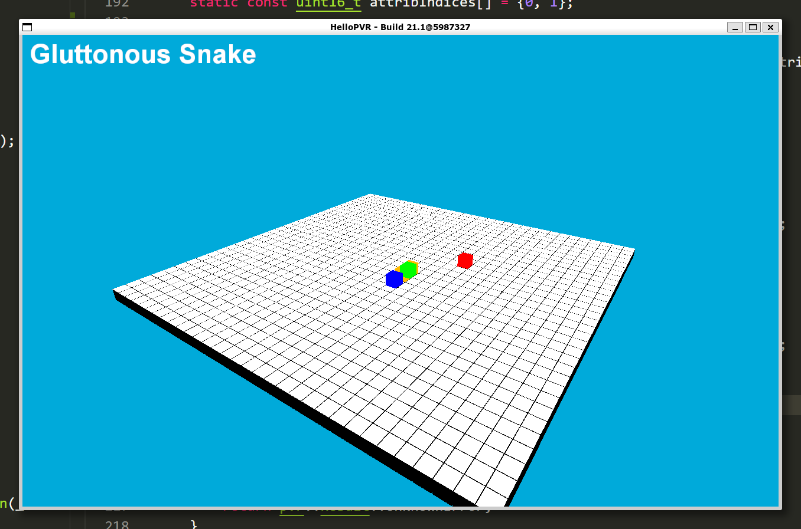
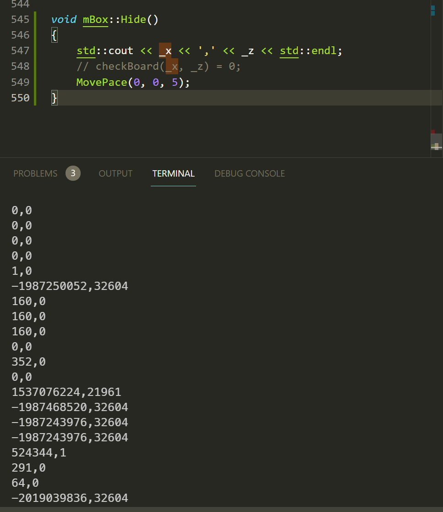
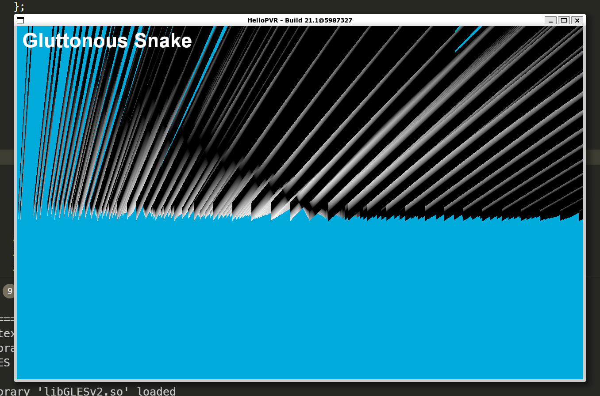

# 贪吃蛇

## 安装

使用Win11下的WSLg重新安装一遍。

- 版本	Windows 11 专业版
- Update	21H2
- 安装日期	‎2021/‎7/‎8
- 操作系统版本	22000.51
- 体验	Windows Feature Experience Pack 421.16300.0.3
- WSL2 发行版：Ubuntu 20.04 LTS（21362+的windows可以使用带有图形界面的[WSLg](https://devblogs.microsoft.com/commandline/wslg-architecture/)，才可以运行）

cmake SDK之后，运行Makefile即可。具体操作过程见：

https://blog.csdn.net/weixin_45502929/article/details/118792099

## 描述

- 一条蛇（负责展现体型）
- 头、尾（负责表示动效）
- 食物

每次：

- 如果在格点处：利用头的方向、头的位置，计算运动过程（这个需要保存）；将运动的头节点加入body，生成新的头部；销毁尾部节点，将尾指针指向body最后一个
- 如果不在格点处：头按照已有方向继续运动，尾部朝向body最后一个节点的位置移动。直到上一次预备的计算过程完成
- 如果即将到达treat，蛇加长，treat重新计算
- 如果碰到身体中任意一节，判死

需要保存：

- 头的方向
- 头的位置（用于生成一系列的位置）
- 身体各部位

由于有方向，所以之前的Cube变量不够用了。封装一个带有方向的数据结构mbox。

整条蛇身通过双向链表std::list来建构。

>一些思考：
>
>在划分实现层级时，如果将吃到treat的逻辑判断加进来，则蛇的运动就是直接要实现的原子单元但如果着眼于难以实现的蛇的运动，则一个方块的运动甚至都是一个单元。这说明了适当的单元划分对于代码实现的重要性。

## debug

- extern变量：直接放到一个文件里

- 头尾方向不一样的原因是，初始化curDirc的方向不同。

- 局部变量在renderframe中初始化，因而始终没有办法判断为真。

- 不Init绑定Buffer，在render时就会segfault

- 利用renderframe中的一行代码，以及一个顺序的调整实现了不断裂的转弯以及加长。
- 可视化的方法仍然受用：

- 增加立体感的尝试失败了，由于之前的着色器都是平视，所以会大大增加代码量。
- 在改动过程中出现如下的波纹，思考是数据格式没有对齐。

